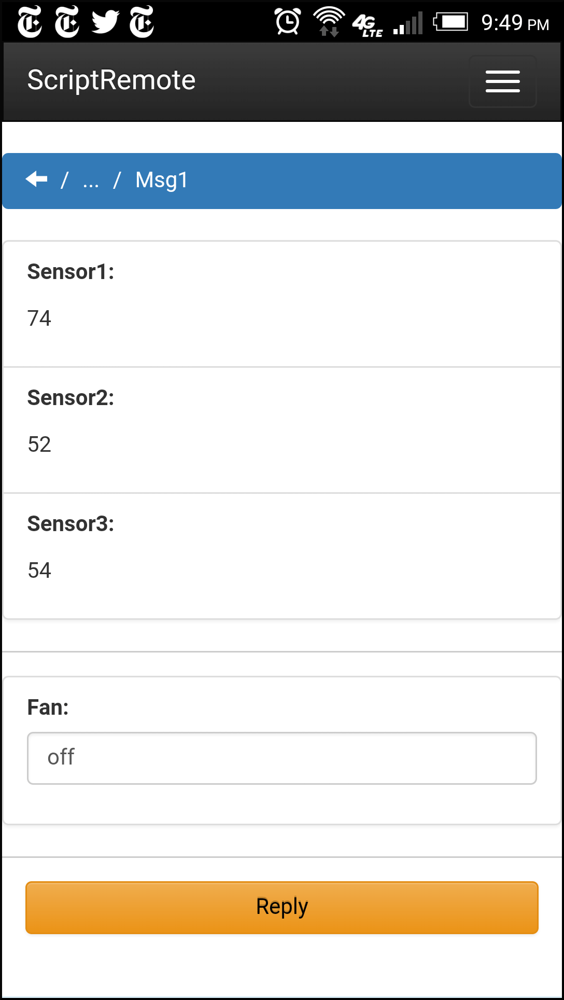

### **Overview**

ScriptRemote is a MEAN-stack project to provide secure remote access to scripted applications from a browser UI. Basically it is a messaging service between scripts running on machines in protected networks and browsers.  The goal is to it make it easy to bring up web UI's for applications for which developing full-custom web or mobile apps is not feasible.

### **Features**

* Configurable browser UI based on AngularJS templates
* Native script-based utilities (bash, python2.7) for script-to-server communication
* API for adding script or other client interfaces 
* Hierarchical message organization
* Message attached files (text, png, svg)
* Message sharing with permissions
* Firewall friendly - uses only http/https and mail protocols
* End-to-end script-browser message encryption
* Notifications

### **Example**

In this simulated IOT example, a script sends a message containing some temperatures obtained from sensors and the current state of a fan switch. It then waits for a reply message, which can leave the fan state unchanged or flip it. The message cycle repeats indefinitely.

The screenshot on the left shows one of the messages viewed under the default UI settings. On the right the settings are changed to use a customized template that better matches the message content.

<div style="text-align:center">


</div>


**Here is the bash script:**


```
#!/bin/bash

# Load utilities SR_start, SR_set, SR_send
. ./srjob.sh

function read_temp {
    # simulate temperature sensor
    echo $((50 + RANDOM % 50))
}

fan_state=off
function fan_control {
    # simulate fan control
    fan_state="$1"
}

SR_start ${SRUSER} ${SRTOKEN} 'MyProject' 'FanControlJob'

while true
do
    # read some temps
    sensor1=$(read_temp 'sensor1')
    sensor2=$(read_temp 'sensor2')
    sensor3=$(read_temp 'sensor3')

    # prepare temps to send
    SR_set 'Sensor1' "$sensor1" 'false'
    SR_set 'Sensor2' "$sensor2" 'false'
    SR_set 'Sensor3' "$sensor3" 'false'

    # prepare fan state to send, reply allowed
    SR_set 'Fan' "$fan_state" 'true'

    # send message, wait for reply
    SR_send 'CheckTemps' 

    if [ "$SR_status" == 'REPLY_TIMEOUT' ]
    then
        # timed out
        SR_clear
        continue
    elif [ "$SR_status" == 'OK' ]
    then
        # get fan reply
        SR_get 'Fan'
        if [ "$SR_output" != "$fan_state" ]
        then
            # change fan state
            fan_control "$SR_output"
        fi
    else
        # got an error
        echo "$SR_status"
        break
    fi
done

SR_end

```

**These are the customized Angular templates:**

The 'ng' attributes provide the links to the [**Angular**](https://angularjs.org) framework. A few HTML5 and [**bootstrap**](http://getbootstrap.com) library features are used for styling. The second template is for the reply part of the message. The reply button is handled by the template's parent element so it does not appear here.

```
<ul class="list-group">
    <li ng-repeat="item in content" class="list-group-item">
        Temperature at {{item.name}}: <meter min="0" max="120" low="0.01" high="90" optimum="78" value="{{item.value}}"></meter><span class="label label-default">{{item.value}}F</span>
    </li>
</ul>


<div class="row">
    <div class="col-sm-1">
        Fan state: 
    </div>
    <div class="col-sm-1">
        <input type="radio" ng-model="replyContent[0].value" value="off">Off
    </div>
    <div class="col-sm-1">
        <input type="radio" ng-model="replyContent[0].value" value="on">On
    </div>
</div>

```

### **Demo Server**

If you would like to try a few tests with ScriptRemote 
before installing there is a server at https://scriptremote.com. 
To use the site:

1. Register

2. Login and get API credentials by selecting **Settings** in the menu bar and then clicking **Generate** in the API Credentials section

3. Copy the API credentials to the test system

4. Download a utility script (bash in this example) to the test system:

    ```shell
    >$ wget https://scriptremote.com/dist/srjob.sh
    ```
    The test system also needs to have <code>curl</code> installed.
    
5. Start with a simple test case:

    ```shell
    >$ cat > test.sh
    #!/bin/bash
    . ./srjob.sh
    SR_start ${SRUSER} ${SRTOKEN} 'myproject' 'myjob'
    SR_set 'myhello' 'Hello World, how are you?' 'false'
    SR_send 'mysend'
    SR_set 'myreply' 'I am ...' 'true'
    SR_send 'mysend'
    SR_get 'myreply'
    SR_end
    ```

6. Export the API credentials and run the test:

    ```shell
    >$ export SRUSER=<youruserid>
    >$ export SRTOKEN=<yourtoken>
    >$ bash test.sh
    ```

7. The messages should now be accessible under **Projects** in the menu bar. Submitting a modified reply to the second message should cause the script to display the new value.


### **Additional Documentation**

* The **Guide** (https://scriptremote.com/doc/guide.html) provides an introduction to ScriptRemote features.
* The **API Reference** (https://scriptremote.com/doc/api/index.html) defines the non-browser endpoints available to clients


### **Installation**

Installation methods vary depending on the platform chosen and level of availability needed for the service. Only simple installation options can be covered here.
<p>
A basic platform choice is between public and private servers.

**Public server**  - Has a public IP and domain name, is probably hosted by a cloud provider, implements standard security protections. Browser access is similar to that for any public website. Script connections to the server will traverse firewalls and/or proxies on the client side, and possibly load balancers/reverse proxies on the server side. Those systems only need to allow script-to-server https requests because long-polling is used for server-to-script data transfer. Support for https/tls is necessary in order to secure browser and script connections.

**Private server** - Is located in a protected network, probably the same one containing the scripted application. Browser access is through a VPN or SSH tunnel client running on the remote device. Script connections might traverse internal firewalls. Use of TLS on the server may not be required if connections through the public net are otherwise protected and there is sufficient confidence in the security of the private network.

For a small site not needing high availability, the server can just be a machine or VPS that can support a MEAN-stack environment and forward email. Another option is a platform-as-a-service vendor that supports MEAN-stack.


[**Installation on Digital Ocean Droplet**](/doc/InstallDigitalOcean.html)

[**Installation on IBM Bluemix**](/doc/InstallBluemix.html)

[**Generic private server installation**](/doc/InstallGeneric.html)

[**Installation for development**](/doc/InstallDevelop.html)


    
### **Author**

Jim Brandt

### **License**

MIT
